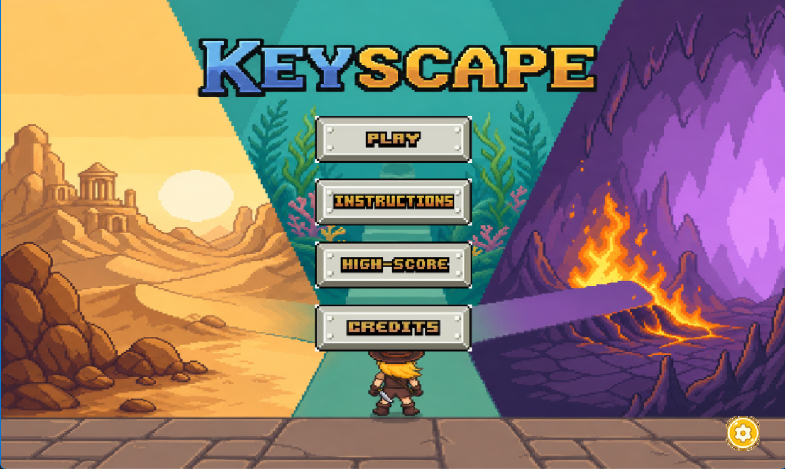
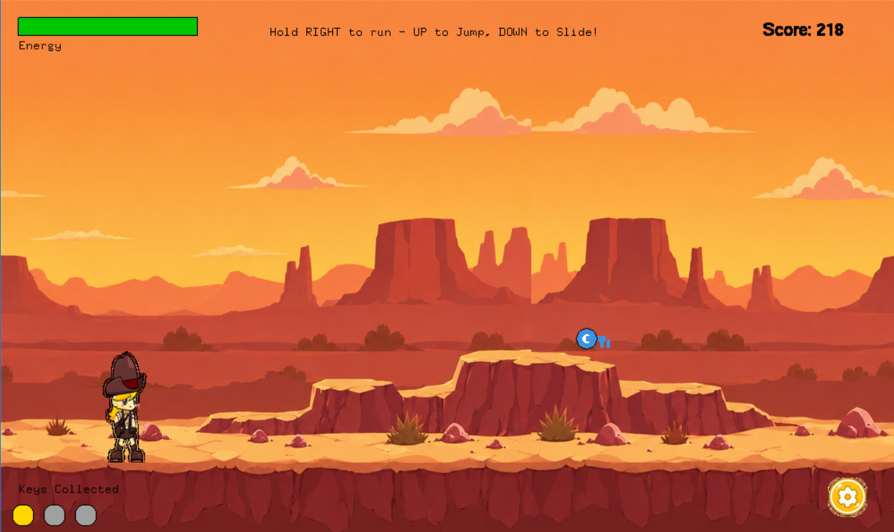
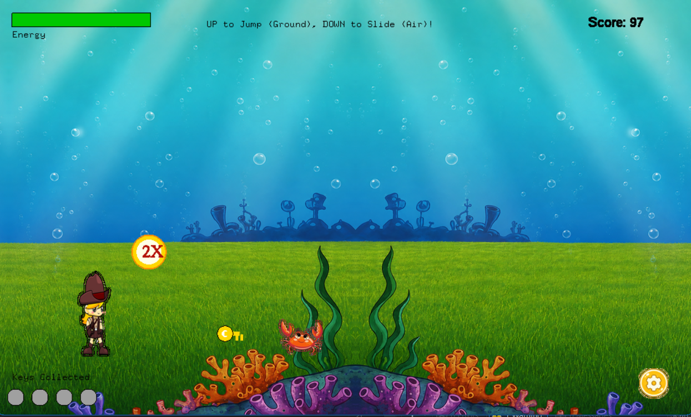
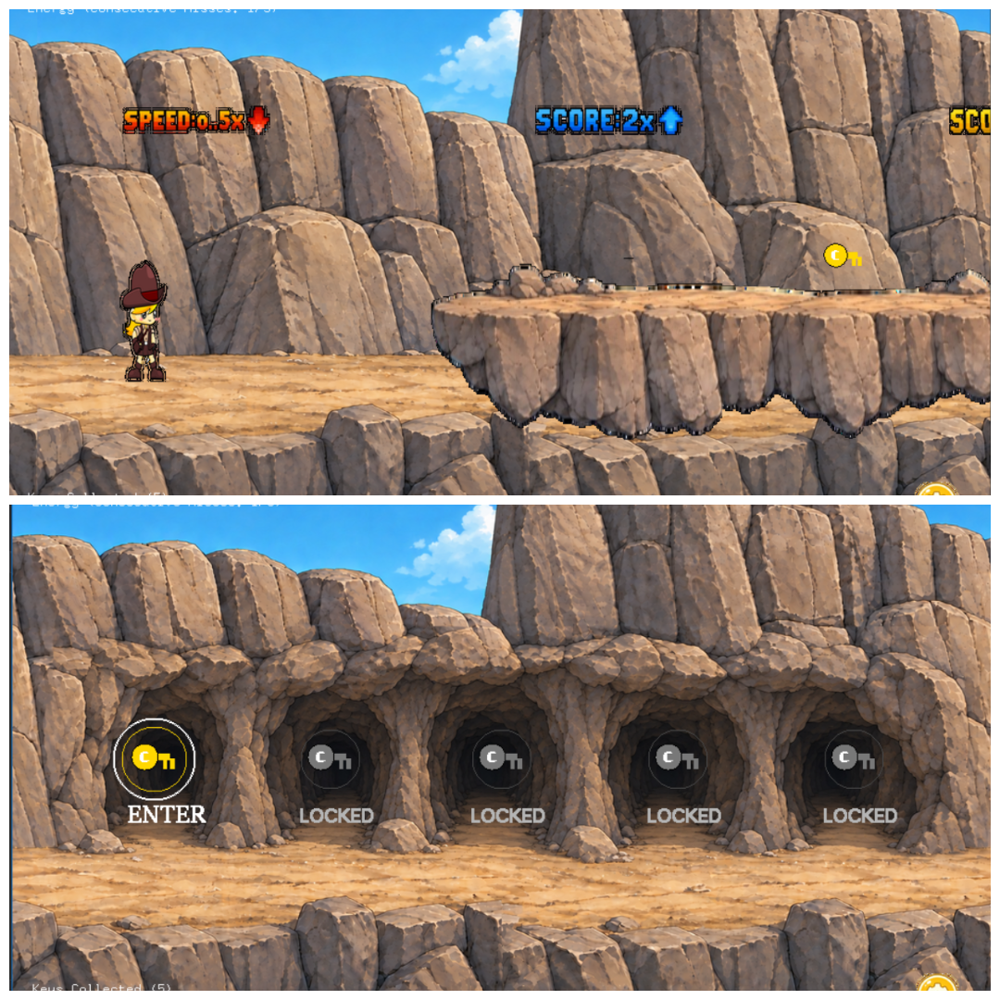

# KeyScape

## Game Description

**KeyScape** is a 2D side-scrolling adventure game created using the **iGraphics** library in C/C++. The player runs, jumps and slides through three themed worlds (desert, undersea and cave), collects keys, and reaches a set of doors at the end of every level. Each door hides a challenge: a puzzle, a duel, a boss fight or a survival minigame.

## Features

- Three themed levels: Desert Escape (Level 1), Undersea Trial (Level 2) and The Five Doors (Level 3).
- Run, jump and slide movement with collision detection.
- Door challenges in every level: 3 doors in Level 1, 4 doors in Level 2 and 5 doors in Level 3.
- Level 1: rune-lock memory puzzle, treasure box, and duels against a Scorpion (sword) or a Mummy (club).
- Level 2: Math, Sliding-Puzzle and Color-Matching door tasks, plus a Guardian boss fight (Approach, Telegraph, Lunge, Retreat).
- Level 3: five independent minigames (bottle dodging, coin collection, crystal cave, cave storm survival, floating steps with a sum-lock puzzle).
- Energy bar, score, power-ups, and a saved high score for each level.
- Background music, sound effects, mute option and an in-game pause/settings menu.

## Project Details

IDE: Visual Studio 2013

Language: C, C++

Platform: Windows PC

Genre: 2D action adventure

## How to Run the Project

Make sure you have the following installed:
- **Visual Studio 2013**
- **iGraphics Library** (included in this repository)

Open the project in Visual Studio 2013
- Open Visual Studio 2013.
- Go to File → Open → Project/Solution.
- Locate and select `KeyScape.sln` from the cloned repository.
- Click Build → Build Solution
- Run the program by clicking Debug → Start Without Debugging

Note: keep the `Image` and `Audios` folders in the project folder so all pictures and sounds load correctly.

## How to Play

### **Controls**

| Action | Key |
|--------|-----|
| Menu navigation and door selection | Mouse (left click) |
| Move Right / Left | `→` / `←` (Arrow Keys) |
| Jump | `↑` (Up Arrow) |
| Slide | `↓` (Down Arrow) |
| Attack (Level 1 duel, Level 2 Guardian knife) | `Space` |
| Ranged attack (Level 2 Guardian fight) | `F` |
| Dodge (Level 2 Guardian fight) | `↑` / `↓` |
| Door 3 (crystal cave): move in any direction / knife | Arrow Keys / `Space` |
| Door 4 (Cave Storm): dodge falling hazards | `←` / `→` |
| Door 5 (floating steps): jump onto the next step | `↑` |
| Pause / Resume | `P` |
| Restart level | `R` |
| Open menu | `M` |
| Sound on / off | `S` |
| Next level (after finishing Level 1) | `N` |
| Back to home page | `Esc` |

### **Game Rules**

- The three buttons on the Play screen select the level: Easy starts Level 1, Medium starts Level 2 and Hard starts Level 3.
- Every level starts with 100 energy. Hitting hazards reduces energy, and the game is over when energy reaches 0.
- Level 1: hitting a cactus costs 12 energy. The Sword deals 15 damage to a Scorpion and the Club deals 18 damage to a Mummy.
- Level 2: collect the 4 colored keys, then pick the right door. A wrong task answer costs 15 energy. Defeat the Guardian (150 energy) using knife and ranged attacks while dodging its lunge.
- Level 3: collect keys and treats along the run, then choose one of the 5 doors and complete its minigame:
  - Door 1: survive 40 seconds of poison bottles and floor holes.
  - Door 2: collect 5 Bronze, 6 Silver and 7 Gold coins and avoid the bomb.
  - Door 3: survive 60 seconds and collect 3 crystals in the cave.
  - Door 4: survive 60 seconds of falling rocks and spikes.
  - Door 5: jump across the floating steps, solve the sum-lock puzzle and open the treasure chest.
- Your best score for each level is saved automatically and shown on the Highscore page.

## Project Contributors

1. Tanusree Saha
2. Sumia Haque Snigdha
3. Wahidunnahar Bhuiyan Nazah

## Screenshots

### **Menu**

### **Level 1**

### **Level 2**

### **Level 3**

## Youtube Link
[CSE 1200 Project: KeyScape](ADD_YOUTUBE_LINK_HERE)

## Project Report
[Project Report: KeyScape](ADD_REPORT_LINK_HERE)

